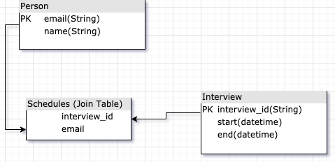

# INTERVIEW CREATION PORTAL

**Technologies used:** Flask(Python backend), Html, JavaScript

[Repository](https://github.com/msiddhu/interview_portal) 
[Application](https://msiddhu.github.io/interview_portal/) 
[Flask API](https://interviewbackend45.herokuapp.com)

### Features:
* Interview Creation
* Interview Edit
* Upcoming Interviews in sorted order
* View participants
* Email sending (Not deployed in production)

### Database Schema:

Person and Interview table have a **many-to-many** relationship.

**Todos:**

1. Resume Upload 
1. Create participants
1. Delete feature